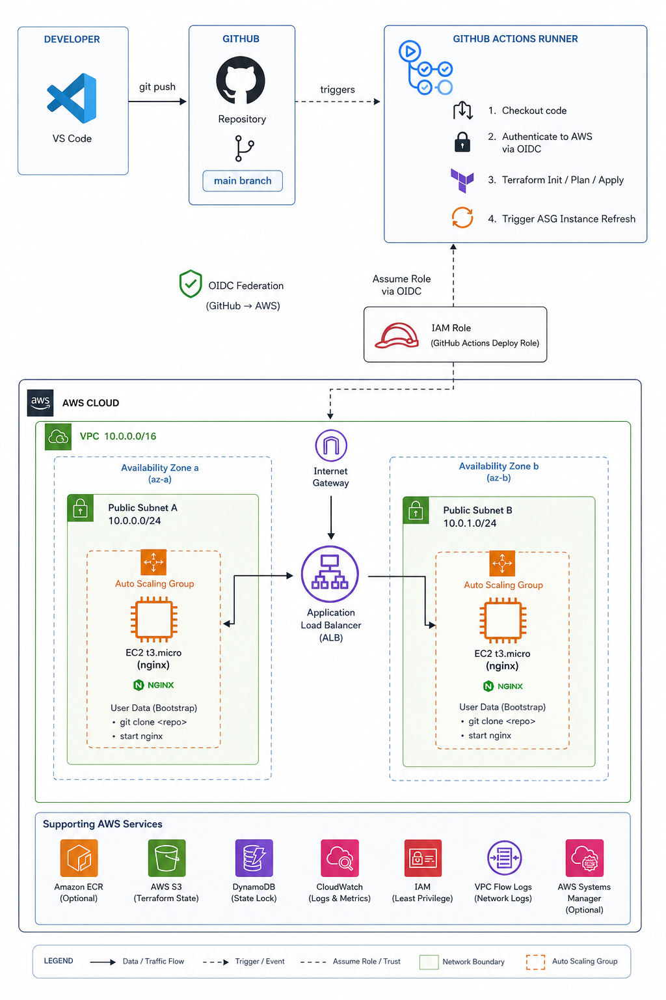

# wesii-infra-1 

A production-style AWS infrastructure project built with Terraform and deployed automatically via GitHub Actions CI/CD pipeline.

## What this project builds

- VPC with 2 public subnets across 2 availability zones
- Application Load Balancer (internet-facing)
- Auto Scaling Group with rolling instance refresh
- EC2 t3.micro instances running nginx
- Security groups with least-privilege rules
- Remote Terraform state in S3 with DynamoDB locking
- GitHub Actions pipeline with AWS OIDC authentication (no static keys)

## Architecture



## Project structure

```
wesii-infra/
├── .github/
│   └── workflows/
│       └── deploy.yml       # CI/CD pipeline
├── app/
│   └── index.html           # the application
├── infra/
│   ├── main.tf              # all AWS resources
│   ├── variables.tf         # configurable values
│   ├── outputs.tf           # ALB DNS output
│   └── user-data.sh         # EC2 bootstrap script
└── .gitignore
```

## How the deployment works

Every push to `main` triggers the pipeline:

1. GitHub Actions authenticates to AWS using OIDC — no static credentials stored anywhere
2. Terraform compares desired state against current AWS infrastructure
3. Any changes are applied automatically
4. An ASG instance refresh is triggered — old EC2 instances are replaced with new ones
5. New instances boot, install nginx, and clone the latest code from GitHub
6. The ALB only routes traffic to healthy instances — zero downtime during deployment

## How to roll back

```bash
# undo the last deployment safely
git revert HEAD
git push origin main
```

The pipeline triggers automatically and deploys the previous version.

## One-time setup

### Prerequisites

- AWS account
- AWS CLI installed and configured
- Terraform installed
- GitHub repository

### 1. Create S3 state bucket

```bash
aws s3api create-bucket \
  --bucket YOUR-BUCKET-NAME \
  --region eu-west-1 \
  --create-bucket-configuration LocationConstraint=eu-west-1

aws s3api put-bucket-versioning \
  --bucket YOUR-BUCKET-NAME \
  --versioning-configuration Status=Enabled
```

### 2. Create DynamoDB lock table

```bash
aws dynamodb create-table \
  --table-name terraform-state-lock \
  --attribute-definitions AttributeName=LockID,AttributeType=S \
  --key-schema AttributeName=LockID,KeyType=HASH \
  --billing-mode PAY_PER_REQUEST \
  --region eu-west-1
```

### 3. Set up OIDC authentication

```bash
aws iam create-open-id-connect-provider \
  --url https://token.actions.githubusercontent.com \
  --client-id-list sts.amazonaws.com \
  --thumbprint-list 6938fd4d98bab03faadb97b34396831e3780aea1
```

Create the IAM role trust policy and attach `AdministratorAccess`.

### 4. Add GitHub secret

In your GitHub repo → Settings → Secrets → Actions → New secret:

| Name | Value |
|------|-------|
| `AWS_ROLE_ARN` | `arn:aws:iam::YOUR_ACCOUNT_ID:role/github-actions-terraform` |

### 5. Update backend config

In `infra/main.tf` update the backend block with your S3 bucket name.

## Deploy

```bash
git add .
git commit -m "your change"
git push origin main
```

The pipeline handles everything. Find the ALB DNS in the Actions log output or in AWS Console → EC2 → Load Balancers.

## Destroy (to avoid costs)

```bash
cd infra
terraform init
terraform destroy
```

Rebuilding takes about 3 minutes:

```bash
terraform apply -auto-approve
```

## Cost estimate

| Resource | Cost |
|----------|------|
| EC2 t3.micro x2 | Free tier / ~$0.02/hr |
| Application Load Balancer | ~$0.008/hr |
| S3 state bucket | ~$0.00/month |
| DynamoDB lock table | Free tier |
| **Total (running)** | **~$0.03/hr** |

Destroy when not in use to pay nothing.

## Technologies used

- **AWS** — EC2, ALB, ASG, VPC, IAM, S3, DynamoDB
- **Terraform** — infrastructure as code
- **GitHub Actions** — CI/CD pipeline
- **OIDC** — keyless AWS authentication
- **nginx** — web server
- **Amazon Linux 2023** — EC2 OS
